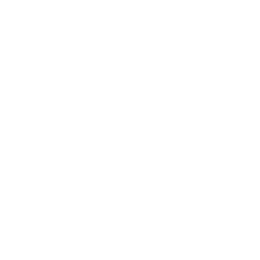

<div align="center">



# ✦ Charan Kumar — Personal Portfolio

### *Software Developer · .NET Specialist · Full-Stack Engineer*

**Building Scalable Digital Solutions & High-Performance Web Experiences**

[](https://nextjs.org/)
[](https://react.dev/)
[](https://dotnet.microsoft.com/)
[](https://www.typescriptlang.org/)
[](https://tailwindcss.com/)

[](https://charan-kumar99.github.io/)
[](https://github.com/charan-kumar99)
[](https://www.linkedin.com/in/charan-kumar-9b20a8378)

---

</div>

## ✨ Overview

A **production-grade professional portfolio** showcasing expertise in .NET ecosystem, Clean Architecture, and Modern Web Development. This platform features immersive 3D interactions, real-time performance optimizations, and an AI-powered assistant to provide a comprehensive look at my professional journey.

```
┌─────────────────────────────────────────────────────────────────────┐
│                                                                     │
│    👤  Charan Kumar                                                 │
│    💼  Software Developer @ AGREMATE Private Limited                │
│    📍  Udupi, Karnataka, India                                      │
│    🚀  Expertise: ASP.NET Core · Microservices · React · Next.js    │
│                                                                     │
└─────────────────────────────────────────────────────────────────────┘
```

## 🌟 Key Features

*   **🎮 Interactive 3D Visuals**: Powered by Three.js and Framer Motion for a premium, tactile feel.
*   **🤖 AI Assistant**: Integrated GROQ-powered chatbot (with Gemini fallback) trained on my professional background.
*   **⚡ High Performance**: Dynamic imports, low-power mode detection, and optimized asset loading.
*   **📊 WakaTime Integration**: Real-time coding stats and activity tracking.
*   **📱 Responsive & Adaptive**: Fluid layouts that adapt to any screen size or hardware capability.

## 🗺️ Project Structure

| Path | Description |
|------|-------------|
| `src/app/` | Next.js App Router (Home, Projects, Skills, Experience, Contact, Gallery, Resume) |
| `src/components/` | Modular UI components, 3D scenes, and layout structures |
| `src/data/` | `portfolio.ts` — The central source of truth for all content |
| `src/hooks/` | Custom hooks for performance, animations, and responsive logic |
| `src/providers/` | Theme, Smooth Scroll, and I18n context providers |
| `public/` | Organized assets (certificates, documents, gallery, icons, lanyard, logos, profile, projects, screenshots) |

## ⚙️ Tech Stack

*   **Frontend**: Next.js 16, React 19, Tailwind CSS, Framer Motion, GSAP
*   **3D/WebGL**: Three.js, React Three Fiber, Rapier Physics
*   **Backend/APIs**: GROQ API (primary), Gemini API (fallback), GitHub API, WakaTime API
*   **Tools**: TypeScript, Lucide Icons, Shadcn/UI

## 🚀 Getting Started

1.  **Clone & Install**:
    ```bash
    git clone https://github.com/charan-kumar99/charan-kumar99.github.io.git
    npm install
    ```
2.  **Environment Setup**: Create `.env.local` and add:
    *   `GROQ_API_KEY` (for chatbot - primary)
    *   `GEMINI_API_KEY` (for chatbot - fallback)
    *   `GITHUB_TOKEN` (for GitHub stats)
    *   `WAKATIME_API_KEY` (for WakaTime stats)
3.  **Run**: `npm run dev`

---
<div align="center">
  Built with ❤️ by Charan Kumar
</div>
